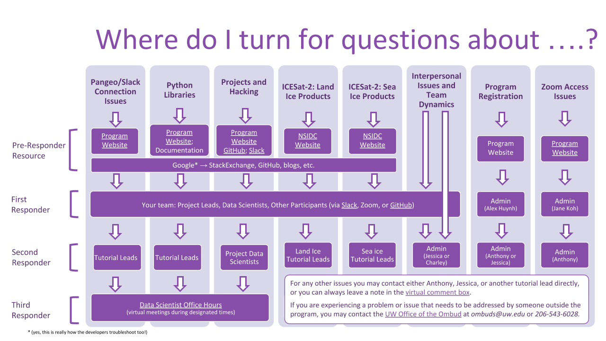

# Getting Help

We know how overwhelming all of this information can be. And sometimes, things just don't work. We've put together this visual decision tree diagram to help you figure out where to turn for help first... and second... and beyond, depending on the type of issue you are having. This enables us all to maximize our learning and teaching throughout the Hackweek.

The figure is also available as a [Google Presentation](https://drive.google.com/file/d/15lneuM6zIwjebq7BaHOdGMLZIVLXGjL6/view?usp=sharing), wherein the underlined text provides links to some resources that may be helpful.

