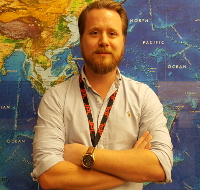

# Our Team

## Jane Koh

* *Affiliation*: eScience Institute
* *Ask me about*: Zoom technical support

## Johan Nilsson

* *Affiliation*: [Jet Propulsion Laboratory, NASA](https://science.jpl.nasa.gov/people/Nilsson/)
* *Ask me about*: 

## Jessica Scheick

* *Affiliation*: University of Maine
* *Ask me about*:
	* icepyx
	* Data Access
	* Data Subsetting
	* Geospatial Data Processing
	* Python (basics)
	* Git / GitHub

## Amy Steiker

* *Affiliation*: National Snow and Ice Data Center
* *Ask me about*: 
	* NSIDC Data Products
	* ICESat-2 Data Access from NSIDC
	* ICESat-2 Data Subsetting Services from NSIDC
	* OpenAltimetry
	* NASA Earthdata

## Lindsey Heagy

* *Affiliation*: U. C. Berkeley
* *Ask me about*:

## Fernando Perez

* *Affiliation*:[Department of Statistics, UC Berkeley](https://bids.berkeley.edu/people/fernando-perez)
* *Ask me about*:
	* Git / GitHub
	* Reproducible Science
	* Jupyter
	* PyData tools (NumPy, SciPy, matplotlib, Pandas)
	* Numerical / scientific computing

## Ellen Buckley

* *Affiliation*: University of Maryland
* *Ask me about*:

## Fernando Paolo

* *Affiliation*: NASA Jet Propulsion Laboratory
* *Ask me about*:

## David Shean

* *Affiliation*: UW Civil and Environmental Engineering
* *Ask me about*:

## Ian Joughin

* *Affiliation*: APL
* *Ask me about*:

## Alek Petty

* *Affiliation*: University of Maryland
* *Ask me about*:

## Axel Schweiger

* *Affiliation*: APL
* *Ask me about*:

## Anthony Arendt

* *Affiliation*: eScience & APL
* *Ask me about*: team building, community software, administrative support

## Ben Smith

* *Affiliation*: APL
* *Ask me about*:
	* Land-Ice Products
	* Gridding
	* Python

## Alex Huynh

* *Affiliation*: APL
* *Ask me about*:

## Matthew Siegfried

* *Affiliation*: [Department of Geophysics, Colorado School of Mines](http://www.minesglaciology.com)
* *Ask me about*:

## Nick Holschuh

* *Affiliation*: Department of Geology, Amherst College
* *Ask me about*:
	* The ICESat-2 Satellite
	* Data Products
	* Data Structures
	* Python

## Scott Henderson

* *Affiliation*: eScience & ESS
* *Ask me about*:
	* Python
	* Conda
	* Jupyter
	* Pangeo / Cloud Computing

## Tom Neumann

* *Affilation*: NASA Goddard Space Flight Center
* *Ask me about*:

## Sebastian Alvis

* *Affiliation*: eScience & APL
* *Ask me about*:
	* Jupyter (and specifically Connecting to the JupyterHub)
	* Git / GitHub
	* Pangeo / Cloud Computing
	* Python
	* Pandas

## Daniel Shapero

* *Affiliation*: APL
* *Ask me about*:
	* Git
	* Shell
	* Python
	* Generalized Geospatial Hackery

## Tyler Sutterley

* *Affiliation*: APL
* *Ask me about*:
	* Git / GitHub
	* Jupyter
	* Python
	* IceSat-2 Data Products
	* Altimetry
